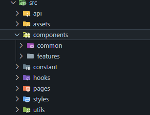

# React + Vite

## git 클론하고 브랜치 생성하는 법

로컬에서 FE/dev 브랜치 클론

```
git clone --branch FE/dev https://github.com/MangoSiruu/nonToxicDiary.git
또는
git clone -b FE/dev https://github.com/MangoSiruu/nonToxicDiary.git
```

올바른 경로로 이동

```
cd /src/frontend
```

브랜치 생성 및 확인

```
git checkout -b 브랜치명
git branch -v
```

커밋 후 push 하는 법

```
git add .
git commit -m "[작업태그] #이슈번호 - 작업내용"
git push origin 브랜치명
```

## How to start

```

cd /src/frontend
npm i
npm run dev

```

## 폴더구조



### 부가 설명

`styles/variants` 폴더에 반응형 디자인을 위한 중단점들과 색상 변수 추가.

필요하실 때 꺼내쓰시면 될 것 같습니다.

```jsx
// 반응형 디자인을 위한 breakpoints
export const breakpoints = {
  initial: '0',
  xs: '520px',
  sm: '768px',
  md: '1024px',
  lg: '1280px',
};

export const colors = {
  mainOrange: '#F27F0C',
  mainGray: '#2D2D2D',
  darkGray: ' #5A5A5A',
  midgray: '#808080',
  lightGray: 'BDBDBD',
  backgroundColor: '#FBF4EE',
  white: '#FFF',
  // 카테고리 색깔들
  point_orange: '#FC9F66',
  point_pink: '#E05D5D',
  point_navy: '#053F5C',
  point_blue: '#429EBD',
  point_mint: '#00A19D',
  point_green: '#1F9057',
};
```
